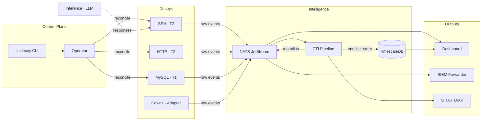
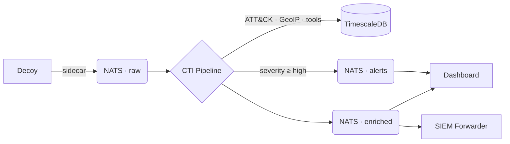

# CI/CDecoy

**The open-source framework for Deception as Code.**

CI/CDecoy lets security teams define, version, and continuously deploy cyber deception assets. Honeypots, honeytokens, and decoy services, all using familiar GitOps workflows on Kubernetes. Every interaction with a decoy is captured, enriched with threat intelligence context, and output as structured CTI.

```yaml
apiVersion: cicdecoy.io/v1alpha1
kind: Decoy
metadata:
  name: ssh-jumpbox-03
spec:
  service: { type: ssh, port: 22 }
  fidelity: { tier: 3, adaptive: { model: llama3 } }
  identity: { hostname: "jump-03", profileRef: "sre-workstation" }
  authentication:
    mode: selective
    credentials:
      - { username: admin, password: "W3lcome2024!" }
  telemetry:
    sessionCapture: { fullTranscript: true, keystrokeTimings: true }
  engage:
    activity: EAC0001
    goal: EG0001
    hypothesis: "Adversaries targeting the DMZ will attempt SSH credential access."
```

```bash
cicdecoy validate decoys/
cicdecoy deploy decoys/ --wait
cicdecoy sessions watch --annotated
```


## Key Features

**Decoy-as-Code.** Decoys are YAML manifests, version-controlled in Git, deployed through CI/CD. Your deception deployments are auditable, reproducible, and rollback-capable.

**Three Fidelity Tiers.** Tier 1 beacons log connections with minimal resources. Tier 2 scripted decoys handle common interactions with realistic entropy. Tier 3 adaptive decoys use an LLM to generate contextually coherent responses across a full interactive session.

**LLM-Backed Interaction.** Tier 3 decoys connect to a shared inference gateway that gives each decoy a personality — realistic filesystem, user accounts, bash history, and installed software.

**Automated CTI Generation.** Every interaction flows through an enrichment pipeline: MITRE ATT&CK mapping, tool identification, behavioral analysis, GeoIP resolution, and kill chain reconstruction. Output as STIX 2.1 bundles, IOC feeds, or direct SIEM integration.

**Kubernetes-Native.** Decoys are Custom Resource Definitions. `kubectl get decoys` works. The operator handles scheduling, health checks, rotation, and auto-recovery.

**Fleet Management.** Deploy dozens of decoys from a single `DecoyFleet` manifest with randomized identities and configurable rotation schedules.

**MITRE Engage Integration.** Every decoy maps to ENGAGE activities, approaches, and goals with per-session intelligence value tracking and null criteria.

**Third-Party Adapters.** Thin sidecar adapters translate Cowrie, Dionaea, T-Pot, and others into the CI/CDecoy common event schema. The pipeline doesn't care where the event came from.

**SIEM Forwarder.** Ship events to Splunk, Elastic, or syslog in enriched or normalized mode. Run both simultaneously.

## Architecture





### Components

| Component | Purpose | Language |
|-----------|---------|----------|
| **Operator** | Reconciles Decoy CRDs into running pods | Python (kopf) |
| **CLI** | Deploy, validate, replay, query intelligence | Go (cobra) |
| **SSH Decoy** | Tier 1–3 SSH honeypot with LLM integration | Python |
| **Inference Gateway** | Shared LLM service for Tier 3 decoys | Python (FastAPI) |
| **CTI Pipeline** | Event enrichment, ATT&CK mapping, storage | Python |
| **Dashboard** | Web UI: live feed, session replay, MITRE heatmap | React + FastAPI |
| **NATS JetStream** | Event routing between all components | — |
| **TimescaleDB** | Time-series event storage | — |
| **Adapters** | Sidecar translators for third-party honeypots | Go |
| **SIEM Forwarder** | Export to Splunk, Elastic, syslog, CEF | Python |

---

## Quick Start

### Prerequisites

- k3s cluster (v1.26+)
- Helm 3
- `kubectl` configured for your cluster

### Install

```bash
# Install the platform
helm repo add cicdecoy https://ghcr.io/cicdecoy/charts
helm install cicdecoy cicdecoy/cicdecoy \
  --namespace cicdecoy-system --create-namespace --wait

# Install the CLI
# (download from releases, or build from source)
make -C Platform cli-build
sudo cp Platform/bin/cicdecoy /usr/local/bin/
```

### Deploy Your First Decoy

```yaml
# my-first-decoy.yaml
apiVersion: cicdecoy.io/v1alpha1
kind: Decoy
metadata:
  name: ssh-honeypot-01
  namespace: decoys-production
spec:
  service:
    type: ssh
    port: 22
  fidelity:
    tier: 2
    scriptedResponses: "openssh-8.9"
  identity:
    hostname: "web-server-03"
    os: { family: linux, distro: "Ubuntu 22.04.3 LTS" }
  authentication:
    mode: selective
    credentials:
      - { username: admin, password: admin123 }
  telemetry:
    sessionCapture: { fullTranscript: true }
    exporter:
      type: nats
      endpoint: "nats://nats:4222"
      subject: "cicdecoy.events.ssh"
```

```bash
cicdecoy validate my-first-decoy.yaml
cicdecoy deploy my-first-decoy.yaml --wait
cicdecoy status decoys
```

### Watch Live Sessions

```bash
cicdecoy sessions watch --annotated
cicdecoy sessions list --live --severity high
cicdecoy sessions replay <session-id> --speed 2
```

### Query Intelligence

```bash
cicdecoy intel iocs --severity high --since 24h
cicdecoy intel mitre --since 7d
cicdecoy intel report --period weekly --format md -o report.md
cicdecoy intel export --format stix --since 30d -o monthly.stix.json
```

## Repository Structure

```
cicdecoy/
│
├── MVP/                            Core platform — decoys, pipeline, dashboard
│   ├── ssh-decoy/                    Tier 1–3 SSH honeypot
│   ├── cti/                          CTI enrichment pipeline
│   │   ├── pipeline.py                 NATS → enrich → TimescaleDB → republish
│   │   ├── enrichment.py              THE canonical MITRE ATT&CK + tool detection module
│   │   ├── session_analyzer.py         Behavioral profiling + intent classification
│   │   ├── falco_correlator.py         Container escape correlation
│   │   └── engage_mapper.py            MITRE Engage outcome tracking
│   ├── dashboard/                    React + FastAPI web UI
│   │   ├── main.py                     Backend — SSE, REST, NATS subscriber
│   │   └── src/                        React SPA — sessions, replay, MITRE heatmap
│   ├── inference/                    LLM inference gateway for Tier 3
│   ├── config/                       Schema, NATS config, Falco rules, engage annotations
│   ├── profiles/                     Device personality profiles (JSON)
│   ├── tests/                        pytest suite — enrichment, dashboard, schema, sessions
│   ├── tools/                        Response capture utilities
│   └── docker-compose.dev.yaml       Local development stack
│
├── Platform/                       Kubernetes deployment layer
│   ├── helm/cicdecoy/                Helm chart
│   │   ├── crds/                       Decoy, DecoyTemplate, HoneyToken, DecoyProfile, DecoyFleet
│   │   ├── templates/                  Operator, TimescaleDB, CTI pipeline, dashboard,
│   │   │                               NATS init, inference, network policies, SIEM forwarder
│   │   ├── files/                      Populated from MVP/config by setup script
│   │   └── values.yaml
│   ├── cli/                          Go CLI (cobra)
│   │   ├── cmd/                        deploy, destroy, status, sessions, intel, validate,
│   │   │                               logs, fleet, rotate, profile, config
│   │   └── pkg/                        k8s client, NATS client, DB client, output printer
│   ├── operator/                     Kubernetes operator (kopf)
│   │   └── reconciler.py              Decoy CR → Deployment + Service + NetworkPolicy
│   ├── setup-helm-files.sh           Copies MVP/config into Helm chart files/
│   └── Makefile                      build → k3s-import → helm install → deploy
│
├── Adapters/                       Third-party honeypot integration
│   ├── pkg/
│   │   ├── schema/                   Common event schema (the contract)
│   │   ├── adapter/                  Adapter interface
│   │   └── nats/                     Shared NATS publisher with buffering
│   ├── cowrie/                       Cowrie SSH/Telnet adapter
│   ├── dionaea/                      Dionaea multi-protocol adapter
│   ├── tpot/                         T-Pot Elasticsearch adapter
│   ├── deploy/helm/                  Per-adapter Helm charts (sidecar pattern)
│   └── Dockerfile
│
├── Forwarder/                      SIEM export
│   ├── forwarder.py                  Main loop — NATS consumer, dual-mode
│   ├── formatters/
│   │   ├── splunk_hec.py
│   │   ├── elastic.py
│   │   ├── cef.py
│   │   └── syslog.py
│   ├── Dockerfile
│   └── requirements.txt
│
└── docs/
    ├── architecture.md
    ├── deception-as-code.md          The DaC manifesto
    ├── decoy-authoring.md
    ├── profile-authoring.md
    ├── adapter-contract.md           How to write an adapter
    ├── cti-integration.md
    ├── cli-reference.md
    ├── threat-model.md
    └── contributing.md
```

### CRD Kinds

| Kind | Purpose |
|------|---------|
| `Decoy` | Single deception asset — SSH, HTTP, MySQL, etc. |
| `DecoyTemplate` | Reusable parameterized decoy definition |
| `DecoyProfile` | OS/network fingerprint for realistic identity |
| `HoneyToken` | Canary credential or file placed inside decoys |
| `DecoyFleet` | Deploy N decoys from a template across zones |

### NATS Streams

| Stream | Subjects | Retention | Purpose |
|--------|----------|-----------|---------|
| `DECOY_EVENTS` | `cicdecoy.decoy.events.>` | 72h | Raw events from decoys and adapters |
| `ENRICHED_EVENTS` | `cicdecoy.enriched.events.>` | 72h | Post-enrichment pipeline output |
| `ALERTS` | `cicdecoy.alert.>` | 7d | High-severity alerts |
| `HONEYTOKEN_EVENTS` | `cicdecoy.honeytoken.>` | 30d | Token trigger events |
| `FALCO_ALERTS` | `cicdecoy.security.falco.>` | 30d | Container escape detection (immutable) |
| `PLATFORM` | `cicdecoy.platform.>` | 7d | Operator health and audit |

---

## CLI Reference

```
cicdecoy deploy <manifest|dir>       Deploy decoys from YAML
cicdecoy destroy <name|--all>        Remove decoys
cicdecoy rotate <name|--all>         Trigger identity rotation
cicdecoy status [decoys|health]      Platform and fleet overview
cicdecoy fleet list|scale|rotate     Fleet management
cicdecoy sessions list               List sessions (--live, --severity, --since)
cicdecoy sessions watch              Real-time activity stream
cicdecoy sessions replay <id>        Terminal replay with ATT&CK annotations
cicdecoy sessions export <id>        Export as JSON, CSV, or STIX 2.1
cicdecoy intel iocs                  Active indicators of compromise
cicdecoy intel actors                Observed threat actors
cicdecoy intel mitre                 ATT&CK technique frequency
cicdecoy intel honeytokens           Honeytoken trigger history
cicdecoy intel export                Bulk export (STIX, CSV, JSON)
cicdecoy intel report                Generate intelligence report
cicdecoy validate <manifest>         Lint, schema check, fidelity pre-check
cicdecoy logs <decoy> [-f]           Stream interaction logs
cicdecoy profile list|show           Manage decoy profiles
cicdecoy config view|set             CLI configuration
```

## Development

### Local Development (docker-compose)

```bash
cd MVP
docker compose -f docker-compose.dev.yaml up -d
# Dashboard at http://localhost:8080
# NATS at localhost:4222
# TimescaleDB at localhost:5432
```

### Kubernetes Development (k3s)

```bash
cd Platform
./setup-helm-files.sh          # Copy configs into Helm chart
make deploy                    # Build images → import to k3s → helm install
make status                    # Check pods, decoys, NATS streams
make logs-pipeline             # Tail CTI pipeline
```

### Tests

```bash
cd MVP/tests
pip install -r requirements.txt
pytest -v
```

## Documentation

| Document | Description |
|----------|-------------|
| [Deception as Code](docs/specifications/deception-as-code-spec.md) | The DaC concept and manifesto |
| [Adapter Contract](docs/specifications/adapter-contract.md) | How to write a third-party adapter |

---

## License

Apache License 2.0. See [LICENSE](LICENSE) for details.
