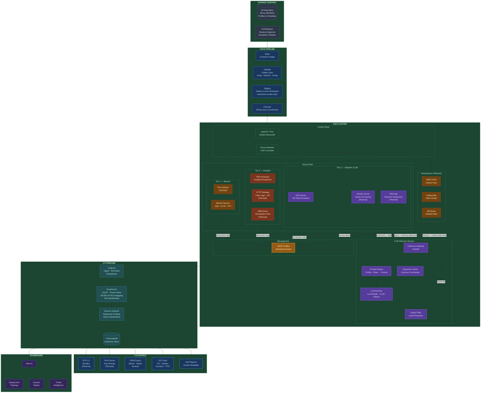
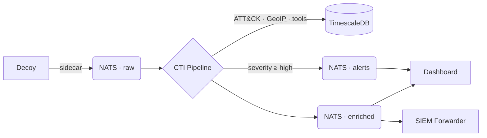

# CI/CDecoy

**The open-source framework for Deception as Code.**

CI/CDecoy lets security teams define, version, and continuously deploy cyber deception assets. Honeypots, honeytokens, and decoy services, all using familiar GitOps workflows on Kubernetes. Every interaction with a decoy is captured, enriched with threat intelligence context, and output as structured CTI.

```yaml
apiVersion: cicdecoy.io/v1alpha1
kind: Decoy
metadata:
  name: ssh-jumpbox-03
spec:
  service: { type: ssh, port: 22 }
  fidelity: { tier: 3, adaptive: { model: llama3 } }
  identity: { hostname: "jump-03", profileRef: "sre-workstation" }
  authentication:
    mode: selective
    credentials:
      - { username: admin, password: "W3lcome2024!" }
  telemetry:
    sessionCapture: { fullTranscript: true, keystrokeTimings: true }
  engage:
    activity: EAC0001
    goal: EG0001
    hypothesis: "Adversaries targeting the DMZ will attempt SSH credential access."
```

```bash
cicdecoy validate decoys/
cicdecoy deploy decoys/ --wait
cicdecoy sessions watch --annotated
```

## Key Features

**Decoy-as-Code.** Decoys are YAML manifests, version-controlled in Git, deployed through CI/CD. Your deception deployments are auditable, reproducible, and rollback-capable.

**Three Fidelity Tiers.** Tier 1 beacons log connections with minimal resources. Tier 2 scripted decoys handle common interactions with realistic entropy. Tier 3 adaptive decoys use an LLM to generate contextually coherent responses across a full interactive session.

**LLM-Backed Interaction.** Tier 3 decoys connect to a shared inference gateway that gives each decoy a personality — realistic filesystem, user accounts, bash history, and installed software.

**Automated CTI Generation.** Every interaction flows through an enrichment pipeline: MITRE ATT&CK mapping, tool identification, behavioral analysis, GeoIP resolution, and kill chain reconstruction. Output as structured JSON, CSV, or direct SIEM integration. STIX 2.1 indicator export is available for IOCs; full STIX bundle export and TAXII server integration are planned.

**Kubernetes-Native.** Decoys are Custom Resource Definitions. `kubectl get decoys` works. The operator handles scheduling, health checks, rotation, and auto-recovery.

**Fleet Management.** Deploy dozens of decoys from a single `DecoyFleet` manifest with randomized identities and configurable rotation schedules.

**MITRE Engage Integration.** Every decoy maps to ENGAGE activities, approaches, and goals with per-session intelligence value tracking and null criteria.

**Third-Party Adapters.** Thin sidecar adapters that will translate Cowrie, Dionaea, T-Pot, and others into the CI/CDecoy common event schema. The pipeline doesn't care where the event came from.

**SIEM Forwarder.** Ship events to Splunk, Elastic, or syslog in enriched or normalized mode. Run both simultaneously.

## Platform Architecture





### Components

| Component | Purpose | Language |
|-----------|---------|----------|
| **Operator** | Reconciles Decoy CRDs into running pods | Python (kopf) |
| **CLI** | Deploy, validate, replay, query intelligence | Go (cobra) |
| **SSH Decoy** | Tier 1-3 SSH honeypot with LLM integration | Python |
| **Inference Gateway** | Shared LLM service for Tier 3 decoys | Python (FastAPI) |
| **CTI Pipeline** | Event enrichment, ATT&CK mapping, storage | Python |
| **Dashboard** | Web UI: live feed, session replay, MITRE heatmap | React + FastAPI |
| **NATS JetStream** | Event routing between all components | — |
| **TimescaleDB** | Time-series event storage | — |
| **Adapters** | Sidecar translators for third-party honeypots | Go |
| **SIEM Forwarder** | Export to Splunk, Elastic, syslog, CEF | Python |

---

## Quick Start

### Prerequisites

- k3s cluster (v1.26+)
- Helm 3
- `kubectl` configured for your cluster

### Install

```bash
# Install the platform
helm repo add cicdecoy https://ghcr.io/cicdecoy/charts
helm install cicdecoy cicdecoy/cicdecoy \
  --namespace cicdecoy-system --create-namespace --wait

# Install the CLI
# (download from releases, or build from source)
make -C platform cli-build
sudo cp platform/bin/cicdecoy /usr/local/bin/
```

### Deploy Your First Decoy

```yaml
# my-first-decoy.yaml
apiVersion: cicdecoy.io/v1alpha1
kind: Decoy
metadata:
  name: ssh-honeypot-01
  namespace: decoys-production
spec:
  service:
    type: ssh
    port: 22
  fidelity:
    tier: 2
    scriptedResponses: "openssh-8.9"
  identity:
    hostname: "web-server-03"
    os: { family: linux, distro: "Ubuntu 22.04.3 LTS" }
  authentication:
    mode: selective
    credentials:
      - { username: admin, password: admin123 }
  telemetry:
    sessionCapture: { fullTranscript: true }
    exporter:
      type: nats
      endpoint: "nats://nats:4222"
      subject: "cicdecoy.events.ssh"
```

```bash
cicdecoy validate my-first-decoy.yaml
cicdecoy deploy my-first-decoy.yaml --wait
cicdecoy status decoys
```

### Watch Live Sessions

```bash
cicdecoy sessions watch --annotated
cicdecoy sessions list --live --severity high
cicdecoy sessions replay <session-id> --speed 2
```

### Query Intelligence

```bash
cicdecoy intel iocs --severity high --since 24h
cicdecoy intel mitre --since 7d
cicdecoy intel report --period weekly --format md -o report.md
cicdecoy intel export --format stix --since 30d -o monthly.stix.json
```

## Repository Structure

```bash
cicdecoy/
│
├── ssh-decoy/                      Tier 1–3 SSH honeypot (Python, asyncssh)
├── cti/                            CTI enrichment pipeline
│   ├── pipeline.py                   NATS → enrich → TimescaleDB → republish
│   ├── enrichment.py                 MITRE ATT&CK + tool detection
│   ├── session_analyzer.py           Behavioral profiling + intent classification
│   ├── falco_correlator.py           Container escape correlation
│   └── engage_mapper.py              MITRE Engage outcome tracking
├── dashboard/                      React + FastAPI web UI
│   ├── main.py                       Backend — SSE, REST, NATS subscriber
│   └── src/                          React SPA — sessions, replay, MITRE heatmap
├── inference/                      LLM inference gateway for Tier 3
│
├── config/                         Shared infrastructure config
│   ├── schema.sql                    TimescaleDB schema
│   ├── nats.conf                     NATS JetStream config
│   ├── falco-rules.yaml              Container escape detection
│   └── engage-annotations.yaml       MITRE Engage mappings
├── decoys/                         Decoy definitions and data
│   ├── examples/                     Example decoy manifests
│   ├── profiles/                     Device personality profiles (JSON)
│   └── responses/                    Scripted response databases
│
├── platform/                       Kubernetes deployment layer
│   ├── helm/cicdecoy/                Helm chart (CRDs, templates, values)
│   ├── cli/                          Go CLI (cobra)
│   ├── operator/                     Kubernetes operator (kopf)
│   ├── setup-helm-files.sh           Populates Helm chart from config/ and decoys/
│   └── Makefile                      build → k3s-import → helm install → deploy
│
├── adapters/                       Third-party honeypot integration (Go)
│   ├── pkg/                          Common event schema, adapter interface, NATS publisher
│   ├── adapters/                     Cowrie, Dionaea, T-Pot implementations
│   └── deploy/helm/                  Per-adapter Helm charts
│
├── siem-forwarder/                 SIEM export (Go) — Splunk, Elastic, syslog, webhook
│
├── tests/                          Test suites (pytest)
│   ├── ssh-decoy/                    SSH decoy unit tests
│   ├── cti/                          CTI enrichment tests
│   ├── dashboard/                    Dashboard API tests
│   └── schema/                       Event schema validation
│
├── tools/                          Response capture utilities
├── docs/                           Documentation and specifications
├── docker-compose.yaml             Local development stack (no API keys needed)
└── Makefile                        Dev workflow: up, test, ssh, logs, dashboard
```

### CRD Kinds

| Kind | Purpose |
|------|---------|
| `Decoy` | Single deception asset — currently SSH; HTTP, MySQL, SMB planned |
| `DecoyTemplate` | Reusable parameterized decoy definition |
| `DecoyProfile` | OS/network fingerprint for realistic identity |
| `HoneyToken` | Canary credential or file placed inside decoys (CRD defined; placement and trigger detection planned) |
| `DecoyFleet` | Deploy N decoys from a template across zones |

### NATS Streams

| Stream | Subjects | Retention | Purpose |
|--------|----------|-----------|---------|
| `DECOY_EVENTS` | `cicdecoy.decoy.events.>` | 72h | Raw events from decoys and adapters |
| `ENRICHED_EVENTS` | `cicdecoy.enriched.events.>` | 72h | Post-enrichment pipeline output |
| `ALERTS` | `cicdecoy.alert.>` | 7d | High-severity alerts |
| `HONEYTOKEN_EVENTS` | `cicdecoy.honeytoken.>` | 30d | Token trigger events |
| `FALCO_ALERTS` | `cicdecoy.security.falco.>` | 30d | Container escape detection (immutable) |
| `PLATFORM` | `cicdecoy.platform.>` | 7d | Operator health and audit |

---

## CLI Reference

```bash
cicdecoy deploy <manifest|dir>       Deploy decoys from YAML
cicdecoy destroy <name|--all>        Remove decoys
cicdecoy rotate <name|--all>         Trigger identity rotation
cicdecoy status [decoys|health]      Platform and fleet overview
cicdecoy fleet list|scale|rotate     Fleet management
cicdecoy sessions list               List sessions (--live, --severity, --since)
cicdecoy sessions watch              Real-time activity stream
cicdecoy sessions replay <id>        Terminal replay with ATT&CK annotations
cicdecoy sessions export <id>        Export as JSON, CSV, or STIX 2.1
cicdecoy intel iocs                  Active indicators of compromise
cicdecoy intel actors                Observed threat actors
cicdecoy intel mitre                 ATT&CK technique frequency
cicdecoy intel honeytokens           Honeytoken trigger history
cicdecoy intel export                Bulk export (STIX, CSV, JSON)
cicdecoy intel report                Generate intelligence report
cicdecoy validate <manifest>         Lint, schema check, fidelity pre-check
cicdecoy logs <decoy> [-f]           Stream interaction logs
cicdecoy profile list|show           Manage decoy profiles
cicdecoy config view|set             CLI configuration
```

## Development

### Local Development (docker-compose)

```bash
docker compose up -d
# Dashboard at http://localhost:8080
# NATS at localhost:4222
# TimescaleDB at localhost:5432
```

Or use the Makefile shortcuts:

```bash
make up          # Tier 2 stack
make up-tier3    # Tier 2 + Tier 3 (local LLM via Ollama)
make ssh         # SSH into the Tier 2 decoy
make dashboard   # Open dashboard in browser
```

### Kubernetes Development (k3s)

```bash
cd platform
./setup-helm-files.sh          # Copy configs into Helm chart
make deploy                    # Build images → import to k3s → helm install
make status                    # Check pods, decoys, NATS streams
make logs-pipeline             # Tail CTI pipeline
```

### Tests

```bash
cd tests
pip install -r requirements.txt
pytest -v
```

## Documentation

| Document | Description |
|----------|-------------|
| [Deception as Code](docs/specifications/deception-as-code-spec.md) | The DaC concept and manifesto |
| [Adapter Contract](docs/specifications/adapter-contract.md) | How to write a third-party adapter |

---

## Roadmap

The following capabilities are designed and specified but not yet implemented. They appear as "(Planned)" throughout the architecture diagram above.

### Protocol Decoys

- HTTP/HTTPS web decoy (Tier 2 scripted login pages and APIs, Tier 3 LLM-driven dynamic responses)
- MySQL decoy (Tier 3 adaptive query processing)
- SMB honeytoken file share decoy
- Additional protocol decoys: FTP, DNS, Telnet, SMTP

### Threat Intelligence Export

- STIX 2.1 full bundle export (basic IOC-to-STIX indicator conversion exists in the CLI today)
- TAXII server for automated intel sharing
- IOC feed generation

### Honeytokens

- Honeytoken placement and seeding inside decoys (the `HoneyToken` CRD is defined; runtime placement and trigger detection are not yet implemented)

Contributions toward any of these are welcome. See [CONTRIBUTING.md](CONTRIBUTING.md) for how to get involved.

---

## License

Apache License 2.0. See [LICENSE](LICENSE) for details.
